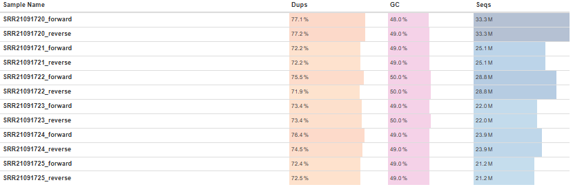
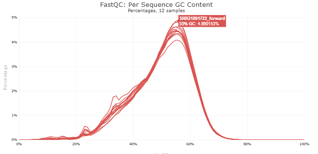
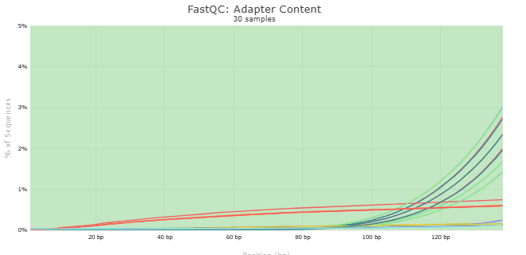
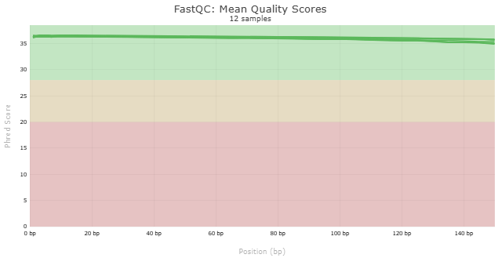
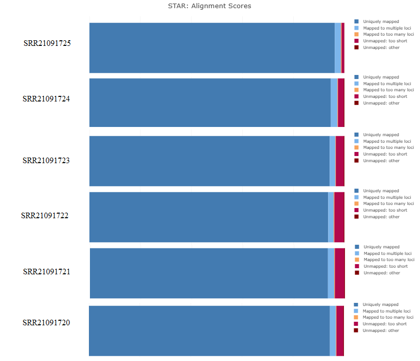
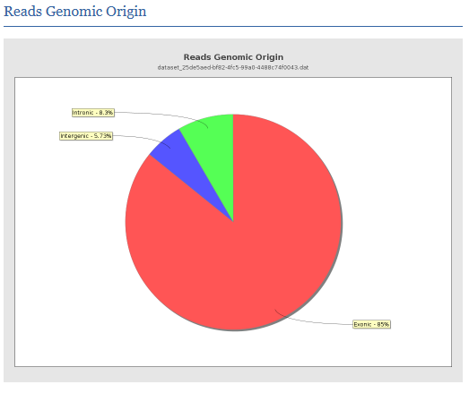
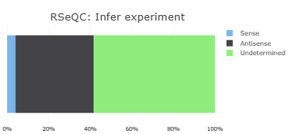
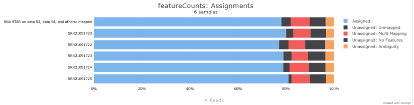

# A Transcriptomic (RNA-seq) Analysis of *Drosophila melanogaster* Adult Testes Overexpressing *microRNA-2b-1*

## Introducción
Este proyecto se centra en el análisis transcriptómico utilizando la plataforma Galaxy para reproducir el trabajo descrito en el artículo [A transcriptomic (RNA-seq) analysis of *Drosophila melanogaster* adult testes overexpressing *microRNA-2b-1*](https://www.sciencedirect.com/science/article/pii/S2352340922009520?via%3Dihub). 

El motivo principal de este proyecto es trabajar con datos de RNA-seq pareados (*paired-end*) que están orientados en **reversa** (*reverse orientation*), utilizando **RNA-star**, una herramienta considerada el estándar de excelencia (*state of the art*) en análisis transcriptómico. Este enfoque me permitirá fortalecer mis habilidades en el manejo y análisis de este tipo de datos.

## Información de la muestra 
En este proyecto, se analizaron muestras provenientes de los testículos de moscas macho adultas (*Drosophila melanogaster*) de 3-5 días de edad. Estas muestras fueron recolectadas con el propósito de comprender los genes y/o vías reguladas por *miR-2b-1*, en relación con el fenotipo observado. 
Los datos transcriptómicos fueron generados como lecturas *paired-end* utilizando la tecnología Illumina HiSeq. Se obtuvieron un total de seis muestras: tres pertenecientes al grupo control y tres correspondientes a la condición de sobreexpresión del gen *miR-2b-1*. 

### Datos disponibles en SRA
- **Sobreexpresión de *miR-2b-1*:**
  - [SRR21091720](https://www.ncbi.nlm.nih.gov/sra/?term=SRR21091720)
  - [SRR21091721](https://www.ncbi.nlm.nih.gov/sra/?term=SRR21091721)
  - [SRR21091722](https://www.ncbi.nlm.nih.gov/sra/?term=SRR21091722)

- **Control:**
  - [SRR21091723](https://www.ncbi.nlm.nih.gov/sra/?term=SRR21091723)
  - [SRR21091724](https://www.ncbi.nlm.nih.gov/sra/?term=SRR21091724)
  - [SRR21091725](https://www.ncbi.nlm.nih.gov/sra/?term=SRR21091725)

# Metodología
## Análisis de Control de Calidad
### Estadisticas básicas
Para evaluar la calidad de las lecturas generadas, se utilizó la herramienta **FastQC**, ampliamente reconocida en análisis transcriptómicos. Inicialmente, se realizó un análisis individual para cada muestra, seguido por un análisis consolidado utilizando **MultiQC**, lo cual permitió obtener una visión comparativa y general de los datos crudos de RNA-seq.

  

#### 1. **Contenido de GC**  
Todas las muestras presentan un contenido de GC del **50.0%**, lo cual se encuentra dentro del rango típico y aceptable para análisis de RNA-seq.

#### 2. **Número de Secuencias**  
El número de secuencias obtenidas en este análisis cumple con las recomendaciones de [_Illumina_](https://knowledge.illumina.com/library-preparation/rna-library-prep/library-preparation-rna-library-prep-reference_material-list/000001243) para experimentos de perfilado de expresión génica. Según sus directrices, _"Gene expression profiling experiments that are looking for a quick snapshot of highly expressed genes may only need 5 million to 25 million reads per sample."_

#### 3. **Duplicados**
Los porcentajes de duplicados observados son elevados, lo cual es una característica común en datos de RNA-seq debido a la alta expresión de ciertos genes. Según el estudio [*RNA-seq: Basic Bioinformatics Analysis*](https://pmc.ncbi.nlm.nih.gov/articles/PMC6168365/#S5), los índices de duplicación típicos en RNA-seq pueden variar entre **30% y 90%**, dependiendo de factores como la profundidad de secuenciación y el tamaño del transcriptoma.

Aunque este nivel de duplicación no invalida el análisis, es importante confirmar que los duplicados provienen de transcritos biológicos reales en lugar de artefactos técnicos. Para validar esta suposición, se llevó a cabo un análisis de la relación entre el porcentaje de duplicados y el contenido de **GC**. Este enfoque permite evaluar si los duplicados están asociados con características genómicas específicas o si podrían ser producto de problemas técnicos durante el proceso de secuenciación.

  

El análisis del contenido de GC muestra que las lecturas siguen una distribución modal, sin la presencia de picos agudos ni dobles picos modales. Esto también se ve validado en la siguiente imagen dónde se observa que no hay prácticamente  presencia en el contenido de adaptadores de las secuencias:

  

### Calidad de Secuencia por Base
Siguiendo el razonamiento dado en mi proyecto [Differential gene expression analysis using RNA-seq in the mouse genome focusing on mammary glands](../main/Differential_gene_expression_analysis_using_RNA-seq_in_the_mouse_genome,focusing_on_mammary_glands#calidad-de-secuencia-por-base) no es necesario realizar un control de calidad sobre las lecturas crudas.

  

### Contenido de Secuencia por Base
En la sección **Per base sequence content**, se detecta una **desregulación en el porcentaje de nucleótidos** en las posiciones iniciales, hecho ya explicado en la sección [Contenido de Secuencia por Base](../main/Differential_gene_expression_analysis_using_RNA-seq_in_the_mouse_genome%2Cfocusing_on_mammary_glands/README.md#contenido-de-secuencia-por-base) de mi mencionado proyecto.

  

## Mapeo de Lecturas
El proceso de alineamiento de lecturas se llevó a cabo utilizando **RNA-star**, una herramienta altamente recomendada por el proyecto **ENCODE** (*Encyclopedia of DNA Elements*). Este proyecto, conocido por establecer estándares de gran prestigio en la investigación genómica, sugiere RNA-star debido a su combinación de alta precisión y velocidad en el procesamiento de datos, cualidades indispensables para el análisis de RNA-seq en estudios transcriptómicos de gran escala. [*Brief guide to RNA sequencing analysis for nonexperts in bioinformatics*](https://www.sciencedirect.com/science/article/pii/S1016847824000852#sec0010).

- **Genoma de referencia:** [Drosophila_melanogaster.BDGP6.46.dna.toplevel.fa.gz](https://ftp.ensembl.org/pub/release-113/fasta/drosophila_melanogaster/dna/)
- **Archivo GTF:** [Drosophila_melanogaster.BDGP6.46.113.gtf.gz](https://ftp.ensembl.org/pub/release-113/gtf/drosophila_melanogaster/)

### Parámetros empleados
1. **--sjdbOverhang:** El valor recomendado para esta opción es el tamaño de lectura menos uno (*ReadLength-1*). Como las lecturas tienen una longitud de 150 pb, el valor utilizado fue **149**.
   
2. **--genomeSAindexNbases:** Según la documentación de RNA-star, este parámetro se calcula como `min(14, log2(GenomeLength)/2 - 1)`. Con un tamaño de genoma de aproximadamente 143.7 Mb, el cálculo es:
   - `log2(143,700,000) ≈ 27.43`
   - `(27.43 / 2) - 1 ≈ 12.71`
   - Por lo tanto, se utilizó el valor **12** para esta opción, ya que debe ser un número entero.

Las lecturas alineadas se ordenaron por coordenadas de manera predeterminada en Galaxy.

  

Estos resultados reflejan una alta calidad de alineamiento, ya que todas las muestras superan ampliamente el umbral del **75% de lecturas alineadas de manera única**, considerado como un indicador de buena calidad en experimentos de RNA-seq, según lo establecido en el [repositorio de Harvard Chan](https://github.com/hbctraining/Intro-to-rnaseq-hpc-salmon/blob/master/lessons/05_multiQC.md#assessing-the-quality-control-metrics). 

## Control de calidad en el mapeo de lecturas

### Sesgo 5'-3'
De acuerdo con las buenas prácticas descritas en el mismo repositorio, se analizó el sesgo 5'-3'. Se obtuvo un valor cercano a **1**, lo que indica una distribución uniforme de las lecturas a lo largo de los transcritos.

  

### Análisis de Uniones 
El análisis de uniones muestra que el **86.05%** de las uniones identificadas corresponden a uniones conocidas. Este porcentaje elevado indica que la mayoría de las lecturas se alinean con regiones previamente anotadas en el genoma de referencia, lo cual es ideal para este estudio, dado que no busca identificar transcritos novedosos. 

  

### Origen Genómico de las Lecturas
En el [repositorio de Harvard Chan](https://github.com/hbctraining/Intro-to-rnaseq-hpc-salmon/blob/master/lessons/05_multiQC.md#assessing-the-quality-control-metrics), indican que _Generally in a good library, we expect over 60% of reads to map to exons for mouse and human organisms."_
En este análisis, el **85.97%** de las lecturas se alinearon con regiones exónicas, superando el umbral esperado. Esto confirma que las lecturas provienen principalmente de mRNA .

  

### Orientación de las Lecturas

Para determinar la orientación de las lecturas en este proyecto, se utilizó el programa **infer_experiment.py** de la suite RSeQC. Este análisis identificó tres categorías principales: **Sense**, **Antisense** y **Undetermined**. Los resultados indicaron que una proporción significativa de las lecturas está clasificada como **Antisense**, mientras que una gran cantidad se catalogó como **Undetermined**.

  

Si bien el porcentaje de lecturas clasificadas como "Undetermined" puede generar dudas. Para confirmar que realmente es **antisense**, revisaremos las estadísticas generales de asignación de lecturas obtenidas con **featureCounts**.

## Conteo de lecturas

El conteo de lecturas se realizó utilizando la herramienta de featureCounts de Galaxy para procesar el archivo BAM generado por **RNA-star**. Las opciones configuradas en la herramienta fueron las siguientes:
- **Specify strand information (opción -s)**: **Stranded(Reverse)**
- **Gene annotation file**: **Drosophila_melanogaster.BDGP6.46.113.gtf**
- **Feature type (opción -t)**: **exon**
- **Gene ID attribute (opción -g)**: **gene_id**

### Estadísticas del Conteo

Para evaluar la eficacia del proceso de conteo de lecturas realizado con **featureCounts**, se presenta la siguiente imagen, que resume el porcentaje de lecturas asignadas bajo las configuraciones previamente mencionadas:

  

- **Assigned (Azul claro):** Representa las lecturas correctamente asignadas a exones. Estas lecturas son fundamentales, ya que contribuyen directamente al análisis transcriptómico y a la interpretación biológica de los resultados.  
  - En este caso, todas las muestras superaron el **75% de lecturas asignadas**, lo que demuestra un alto nivel de precisión y éxito en el proceso de conteo.  

A pesar de contar con un porcentaje significativo de lecturas clasificadas como *Undetermined* durante la evaluación de orientación, el alto porcentaje de lecturas asignadas indica que las configuraciones aplicadas en **featureCounts** fueron adecuadas y permitieron obtener resultados consistentes y confiables.

## Análisis de Expresión Diferencial (DEG)

Aunque en el artículo no se detallan los pasos específicos para el análisis de expresión diferencial, se menciona que este fue realizado utilizando el paquete **edgeR** y la versión **22.05 de Galaxy**. Según el autor: [_Differential gene expression was performed using edgeR. Galaxy version 22.05 was used to perform these analyses. Differentially expressed genes along with their respective fold change and expression levels as count per million (CPM) are listed in Supplementary 1_](https://www.sciencedirect.com/science/article/pii/S2352340922009520?via%3Dihub#sec0003).

Basándonos en esta información, la metodología aplicada fue la siguiente:

### Metodología

1. **Anotación de genes:**
   - Se utilizó el paquete **biomaRt** para mapear identificadores de *Ensembl Gene ID* a *Entrez ID*, ya que este último es necesario para el análisis de ontología génica con el paquete **goana**.

2. **Análisis de expresión diferencial:**
   - El paquete **edgeR** se empleó para transformar los valores de expresión en CPM (counts per million), normalizar los datos y llevar a cabo la identificación de genes diferencialmente expresados.
   - Los genes significativamente regulados se seleccionaron utilizando un criterio de **FDR < 0.05**.

El script completo que reproduce este análisis puede consultarse [aquí](./Recursos/DEG_analysis.R).

### Comparación de resultados 

