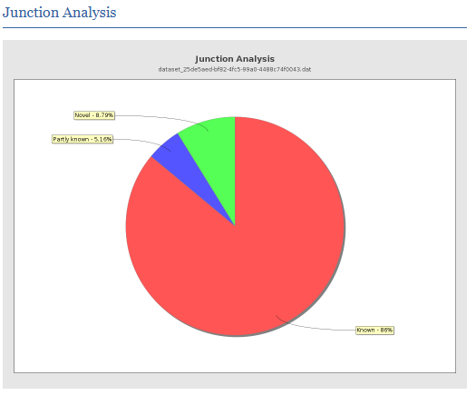
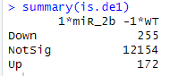

# A Transcriptomic (RNA-seq) Analysis of *Drosophila melanogaster* Adult Testes Overexpressing *microRNA-2b-1*

## Introduction

This project focuses on transcriptomic analysis using the Galaxy platform to replicate the work described in the article [A transcriptomic (RNA-seq) analysis of *Drosophila melanogaster* adult testes overexpressing *microRNA-2b-1*](https://www.sciencedirect.com/science/article/pii/S2352340922009520?via%3Dihub).

The main objective of this project is to work with paired-end RNA-seq data that are oriented in **reverse orientation**, utilizing **RNA-star**, a tool considered the state-of-the-art in transcriptomic analysis. This approach will strengthen my skills in handling and analyzing this type of data.

---

## Sample Information

This project analyzes samples from testes of adult male flies (*Drosophila melanogaster*) aged 3-5 days. The samples were collected to understand genes and/or pathways regulated by *miR-2b-1* in relation to the observed phenotype. Transcriptomic data were generated as paired-end reads using Illumina HiSeq technology. A total of six samples were obtained: three belonging to the control group and three corresponding to the *miR-2b-1* overexpression condition.

### Available Data in SRA
- **Overexpression of *miR-2b-1*:**
  - [SRR21091720](https://www.ncbi.nlm.nih.gov/sra/?term=SRR21091720)
  - [SRR21091721](https://www.ncbi.nlm.nih.gov/sra/?term=SRR21091721)
  - [SRR21091722](https://www.ncbi.nlm.nih.gov/sra/?term=SRR21091722)

- **Control:**
  - [SRR21091723](https://www.ncbi.nlm.nih.gov/sra/?term=SRR21091723)
  - [SRR21091724](https://www.ncbi.nlm.nih.gov/sra/?term=SRR21091724)
  - [SRR21091725](https://www.ncbi.nlm.nih.gov/sra/?term=SRR21091725)

---

# Methodology

## Quality Control Analysis

### Basic Statistics

To evaluate the quality of generated reads, the widely recognized **FastQC** tool for transcriptomic analysis was used. Initially, an individual analysis was conducted for each sample, followed by a consolidated analysis using **MultiQC**, which provided comparative and general insights into raw RNA-seq data.

  

#### 1. **GC Content**  
All samples exhibit a GC content of **50.0%**, which falls within the typical and acceptable range for RNA-seq analysis.

#### 2. **Number of Sequences**  
The number of sequences obtained in this analysis complies with recommendations from [_Illumina_](https://knowledge.illumina.com/library-preparation/rna-library-prep/library-preparation-rna-library-prep-reference_material-list/000001243) for gene expression profiling experiments. According to their guidelines, _"Gene expression profiling experiments that are looking for a quick snapshot of highly expressed genes may only need 5 million to 25 million reads per sample."_

#### 3. **Duplicates**
Observed duplication percentages are elevated, which is a common characteristic of RNA-seq data due to the high expression of certain genes. According to the study [*RNA-seq: Basic Bioinformatics Analysis*](https://pmc.ncbi.nlm.nih.gov/articles/PMC6168365/#S5), typical RNA-seq duplication indices can range between **30% and 90%**, depending on factors such as sequencing depth and transcriptome size. As recommended in [(Klepikova et al. 2017)](https://pmc.ncbi.nlm.nih.gov/articles/PMC5357343/), duplicates should generally not be removed unless unique molecular identifiers are used.

While this level of duplication does not invalidate the analysis, it is important to confirm that duplicates originate from genuine biological transcripts rather than technical artifacts. To validate this assumption, an analysis of the relationship between duplicate percentages and **GC** content was conducted. This approach evaluates whether duplicates are associated with specific genomic characteristics or could stem from technical issues during sequencing.

  

The GC content analysis shows that reads follow a modal distribution, without sharp peaks or double-modal peaks. This is further validated by the image below, which shows minimal adapter content presence in the sequences:

  

---

### Per-Base Sequence Quality

Following the reasoning provided in my project [Differential gene expression analysis using RNA-seq in the mouse genome focusing on mammary glands](../main/Differential_gene_expression_analysis_using_RNA-seq_in_the_mouse_genome,focusing_on_mammary_glands#calidad-de-secuencia-por-base), quality control of raw reads is deemed unnecessary.

  

---

### Sequence Content per Base

In the **Per base sequence content** section, a **deregulation in nucleotide percentages** was detected in initial positions, as already explained in the section [Sequence Content per Base](../main/Differential_gene_expression_analysis_using_RNA-seq_in_the_mouse_genome%2Cfocusing_on_mammary_glands/README.md#contenido-de-secuencia-por-base) of my aforementioned project.

  

---

## Read Mapping

The read alignment process was conducted using **RNA-star**, a tool highly recommended by the **ENCODE** (*Encyclopedia of DNA Elements*) project. This project, known for establishing prestigious genomic research standards, suggests RNA-star due to its combination of high precision and processing speed, qualities indispensable for RNA-seq analysis in large-scale transcriptomic studies. [*Brief guide to RNA sequencing analysis for nonexperts in bioinformatics*](https://www.sciencedirect.com/science/article/pii/S1016847824000852#sec0010).

- **Reference Genome:** [Drosophila_melanogaster.BDGP6.46.dna.toplevel.fa.gz](https://ftp.ensembl.org/pub/release-113/fasta/drosophila_melanogaster/dna/)
- **GTF File:** [Drosophila_melanogaster.BDGP6.46.113.gtf.gz](https://ftp.ensembl.org/pub/release-113/gtf/drosophila_melanogaster/)

---

### Parameters Used

1. **--sjdbOverhang:** The recommended value for this option is the read length minus one (*ReadLength-1*). Since the reads are 150 bp long, the value used was **149**.
   
2. **--genomeSAindexNbases:** According to RNA-star documentation, this parameter is calculated as `min(14, log2(GenomeLength)/2 - 1)`. With a genome size of approximately 143.7 Mb, the calculation is:
   - `log2(143,700,000) ≈ 27.43`
   - `(27.43 / 2) - 1 ≈ 12.71`
   - Thus, the value **12** was used, as it must be an integer.

Aligned reads were sorted by coordinates by default in Galaxy.

  

These results reflect high alignment quality, as all samples far exceed the threshold of **75% uniquely aligned reads**, which is considered a good-quality indicator in RNA-seq experiments, as established in the [Harvard Chan Repository](https://github.com/hbctraining/Intro-to-rnaseq-hpc-salmon/blob/master/lessons/05_multiQC.md#assessing-the-quality-control-metrics).

---

## Quality Control of Read Mapping

### 5'-3' Bias

Following best practices described in the same repository, the 5'-3' bias was analyzed. A value close to **1** was obtained, indicating a uniform distribution of reads along the transcripts.

  

---

### Junction Analysis

The junction analysis reveals that **86.05%** of identified junctions correspond to known junctions. This high percentage demonstrates that most reads align with previously annotated regions in the reference genome, which is ideal for this study, as it does not aim to identify novel transcripts.

  

---

### Genomic Origin of Reads

In the [Harvard Chan Repository](https://github.com/hbctraining/Intro-to-rnaseq-hpc-salmon/blob/master/lessons/05_multiQC.md#assessing-the-quality-control-metrics), it is stated that _"Generally in a good library, we expect over 60% of reads to map to exons for mouse and human organisms."_ In this analysis, **85.97%** of the reads aligned with exonic regions, exceeding the expected threshold. This confirms that the reads primarily originate from mRNA.

  

---

### Read Orientation

To determine the orientation of reads in this project, the **infer_experiment.py** program from the RSeQC suite was used. This analysis identified three main categories: **Sense**, **Antisense**, and **Undetermined**. The results indicate a significant proportion of reads are classified as **Antisense**, with a notable number categorized as **Undetermined**.

  

While the proportion of reads classified as "Undetermined" may raise questions, further confirmation of the **antisense** classification is achieved by reviewing general read assignment statistics obtained with **featureCounts**.

---

## Read Counting

Read counting was performed using Galaxy's featureCounts tool to process the BAM file generated by **RNA-star**. The tool was configured as follows:
- **Specify strand information (option -s):** **Stranded(Reverse)**
- **Gene annotation file:** **Drosophila_melanogaster.BDGP6.46.113.gtf**
- **Feature type (option -t):** **exon**
- **Gene ID attribute (option -g):** **gene_id**

---

### Count Statistics

To evaluate the efficiency of the read-counting process performed with **featureCounts**, the following image summarizes the percentage of reads assigned under the configurations mentioned above:

  

- **Assigned (Light Blue):** Represents reads correctly assigned to exons. These reads are crucial, as they directly contribute to the transcriptomic analysis and the biological interpretation of the results.
  - In this case, all samples surpassed **75% assigned reads**, demonstrating a high level of precision and success in the counting process.

Despite the notable proportion of reads classified as *Undetermined* during orientation evaluation, the high percentage of assigned reads indicates that the configurations applied in **featureCounts** were appropriate, yielding consistent and reliable results.

---

## Differential Expression Analysis (DEG)

While the article does not detail specific steps for differential expression analysis, it mentions that this was performed using the **edgeR** package and Galaxy version **22.05**. According to the authors: [_Differential gene expression was performed using edgeR. Galaxy version 22.05 was used to perform these analyses. Differentially expressed genes along with their respective fold change and expression levels as count per million (CPM) are listed in Supplementary 1_](https://www.sciencedirect.com/science/article/pii/S2352340922009520?via%3Dihub#sec0003).

Based on this information, the following methodology was applied:

---

### Methodology

1. **Gene Annotation:**
   - The **biomaRt** package was used to map *Ensembl Gene IDs* to *Entrez IDs*, as the latter are required for Gene Ontology analysis with the **goana** package.

2. **Differential Expression Analysis:**
   - The **edgeR** package was employed to transform expression values into CPM (counts per million), normalize the data, and identify differentially expressed genes.
   - Significantly regulated genes were selected using a criterion of **FDR < 0.05**.

The complete script reproducing this analysis is available [here](./Recursos/DEG_analysis.R).

---

## Comparison of Results

To evaluate the separation between control and overexpression conditions in this study, a **plotMDS** was generated using the **edgeR** package. This analysis confirmed that samples corresponding to each condition were clearly differentiated, as shown below:

  

- **Green points:** miR_2b
- **Red points:** Control

The original study identified **439 differentially expressed genes**, whereas this analysis identified **427 DEGs** under the same p-value adjustment criterion (FDR < 0.05).

  

While this number is similar, discrepancies may result from variations in methodological steps, as the original article does not detail the exact procedures followed during gene annotation with the **DAVID** tool.

Regarding Gene Ontology, the results show similarities in key processes but also notable differences reflecting the particularities of each analysis. These differences may arise from factors such as adjustments in filtering criteria, genomic annotations employed, or differences in the tools used.

Finally, in evaluating the reproducibility of the published article from a biological perspective, this project underscores the critical importance of reproducible research in biology and science in general. Ensuring that methods and results can be replicated not only increases the reliability of findings but also contributes to advancing scientific knowledge in a robust and transparent manner.

---

