# Análisis Transcriptómico de Glándulas Mamarias en Ratones
## Introducción
Este proyecto sigue los pasos básicos de las buenas prácticas para el análisis transcriptómico usando la plataforma Galaxy. La muestra analizada proviene de tejido mamario de ratones lactantes y embarazados. El objetivo principal de este análisis es comprender los mecanismos moleculares relacionados con la lactancia y el embarazo a través de la identificación de patrones de expresión génica  

## Información de la muestra 
La muestra analizada proviene de tejido mamario de ratones provienente del estudio, titulado [_EGF-mediated induction of Mcl-1 at the switch to lactation is essential for alveolar cell survival_](https://www.nature.com/articles/ncb3117) de Fu et al. (2015). Este estudio examinó los perfiles de expresión de células basales y luminales en la glándula mamaria de ratones vírgenes, embarazados y lactantes.
Específicamente, se trabajó con datos transcriptómicos de las células basales del tejido mamario de ratones lactantes y embarazados, generados como lecturas *single-end* utilizando la tecnología Illumina HiSeq 2000. 
Estos datos están disponibles en el repositorio SRA:
- **Basal pregnant**:
  - [SRR1552452](https://www.ncbi.nlm.nih.gov/sra/?term=SRR1552452)
  - [SRR1552453](https://www.ncbi.nlm.nih.gov/sra/?term=SRR1552453)
  
- **Basal lactate**:
  - [SRR1552454](https://www.ncbi.nlm.nih.gov/sra/?term=SRR1552454)
  - [SRR1552455](https://www.ncbi.nlm.nih.gov/sra/?term=SRR1552455)

# Metodología
## Análisis de Control de Calidad
### Estadisticas básicas
Para evaluar la calidad de las lecturas generadas, se utilizó la herramienta **FastQC**, ampliamente reconocida en análisis transcriptómicos. Inicialmente, se realizó un análisis individual para cada muestra, seguido por un análisis consolidado utilizando **MultiQC**, lo cual permitió obtener una visión comparativa y general de los datos crudos de RNA-seq.

  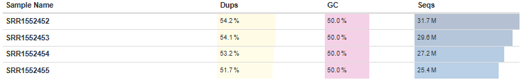

#### 1. **Contenido de GC**  
Todas las muestras presentan un contenido de GC del **50.0%**, lo cual se encuentra dentro del rango típico y aceptable para análisis de RNA-seq.

#### 2. **Número de Secuencias**  
El número total de lecturas por muestra es el siguiente:
- **SRR1552452**: 31.7M
- **SRR1552453**: 29.6M
- **SRR1552454**: 27.2M
- **SRR1552455**: 25.4M  

Estas cifras cumplen con las recomendaciones para RNA-seq. Según la empresa Illumina, en experimentos de expresión génica, [_Gene expression profiling experiments that are looking for a quick snapshot of highly expressed genes may only need 5 million to 25 million reads per sample_](https://knowledge.illumina.com/library-preparation/rna-library-prep/library-preparation-rna-library-prep-reference_material-list/000001243).

#### 3. **Duplicados**  
Los porcentajes de duplicados observados son algo elevados, pero esto es común en datos de RNA-seq debido a la alta expresión de ciertos genes. Aunque esto no invalida el análisis, es recomendable confirmar que los duplicados provienen de transcritos biológicos reales y no de artefactos técnicos. Para validar esto, se analizó la relación entre el porcentaje de duplicados y el contenido de GC.

 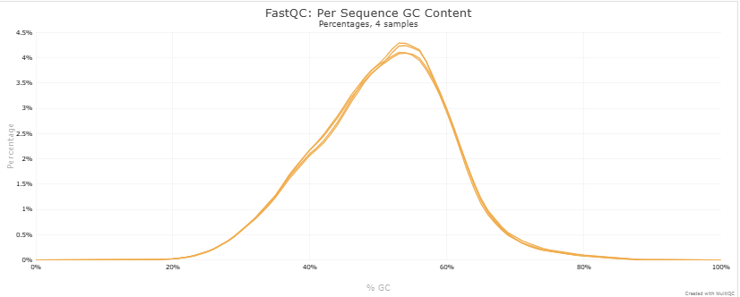 

El análisis del contenido de GC muestra que las lecturas siguen una distribución modal, sin la presencia de picos agudos ni dobles picos modales. Esto respalda la hipótesis de que los duplicados son biológicos y no producto de contaminación ni errores técnicos. Esto también se ve validado en la siguiente imagen dónde se observa que no hay prácticamente  presencia en el contenido de adaptadores de las secuencias:

 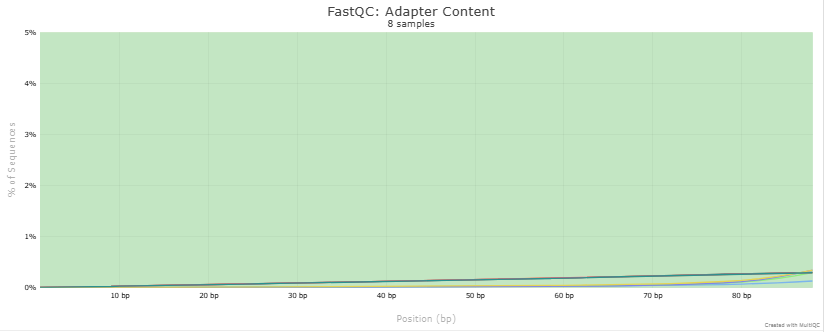 

### Calidad de Secuencia por Base
De acuerdo con el estudio titulado [_A survey of best practices for RNA-seq data analysis_](https://pmc.ncbi.nlm.nih.gov/articles/PMC4728800/#Sec3), "as a general rule, read quality decreases towards the 3’ end of reads, and if it becomes too low, bases should be removed to improve mappability." Sin embargo, la calidad de las lecturas crudas es adecuada y no presenta caídas significativas hacia el extremo 3’. Por lo tanto, no es necesario realizar un control de calidad sobre las lecturas crudas.

 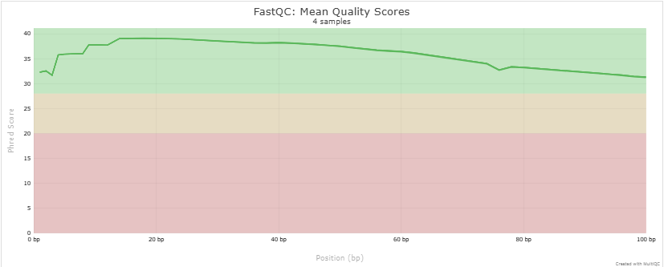 

### Contenido de Secuencia por Base
En la sección **Per base sequence content**, se detecta una **desregulación en el porcentaje de nucleótidos** en las posiciones iniciales.

 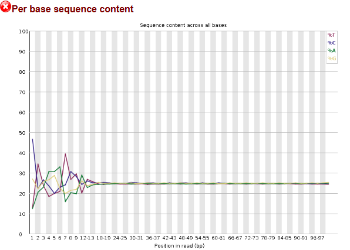 

Tal como lo señala el **Center for Cancer Research (CCR)** del **National Cancer Institute (NCI)** en su guía [_Bioinformatics for Beginners 2022_](https://bioinformatics.ccr.cancer.gov/docs/b4b/Module2_RNA_Sequencing/Lesson10/), la variabilidad observada en las primeras 10-15 bases de las lecturas es un fenómeno normal en experimentos de RNA-seq. Esta fluctuación puede atribuirse al uso de *random primers* durante la preparación de la biblioteca, lo que genera un inicio sesgado en las lecturas.

## Mapeo de Lecturas

El proceso de mapeo se llevó a cabo utilizando **HISAT2**, una herramienta ampliamente utilizada para la alineación de lecturas en análisis transcriptómicos, empleando como referencia el genoma de ratón (**GRCh39/mm39**). Se utilizaron las opciones por defecto, donde el parámetro `-k` está configurado en **5**. En Galaxy, las lecturas mapeadas se ordenan por coordenadas de manera predeterminada.
A continuación, se presentan las estadísticas generales del alineamiento, generadas por **MultiQC**:

  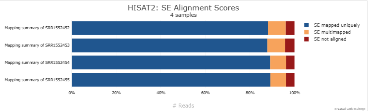

Estos resultados reflejan una alta calidad de alineamiento, ya que todas las muestras superan ampliamente el umbral del **75% de lecturas alineadas de manera única**, considerado como un indicador de buena calidad en experimentos de RNA-seq, según lo establecido en el [repositorio de Harvard Chan](https://github.com/hbctraining/Intro-to-rnaseq-hpc-salmon/blob/master/lessons/05_multiQC.md#assessing-the-quality-control-metrics). 

## Control de calidad en el mapeo de lecturas

### Sesgo 5'-3'
De acuerdo con las buenas prácticas descritas en el mismo repositorio, se analizó el sesgo 5'-3'. Se obtuvo un valor cercano a **1**, lo que indica una distribución uniforme de las lecturas a lo largo de los transcritos.

  

### Análisis de Uniones 
El análisis de uniones muestra que el **81.7%** de las uniones identificadas corresponden a uniones conocidas. Este porcentaje elevado indica que la mayoría de las lecturas se alinean con regiones previamente anotadas en el genoma de referencia, lo cual es ideal para este estudio, dado que no busca identificar transcritos novedosos. 

  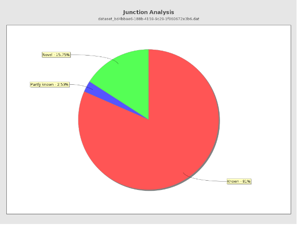

### Origen Genómico de las Lecturas
En el [repositorio de Harvard Chan](https://github.com/hbctraining/Intro-to-rnaseq-hpc-salmon/blob/master/lessons/05_multiQC.md#assessing-the-quality-control-metrics), indican que _Generally in a good library, we expect over 60% of reads to map to exons for mouse and human organisms."_
En este análisis, el **73%** de las lecturas se alinearon con regiones exónicas, superando el umbral esperado. Esto confirma que las lecturas provienen principalmente de mRNA .

  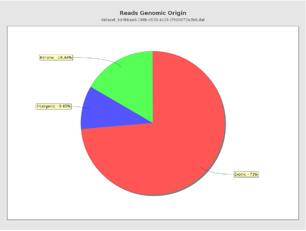

## Conteo de lecturas

El conteo de lecturas se realizó utilizando la herramienta de featureCounts de Galaxy para procesar el archivo BAM generado por **HISAT2**. Las opciones configuradas en la herramienta fueron las siguientes:
- **Specify strand information (opción -s)**: **Unstranded**
- **Gene annotation file**: **Mus_musculus.GRCm39.113.gtf**
- **Feature type (opción -t)**: **exon**
- **Gene ID attribute (opción -g)**: **gene_id**

## Análisis de Expresión Diferencial (DEG)

El script completo puede consultarse [aquí](./Recursos/DEG_analysis.R).

### Metodología

- Se utilizaron datos de *featureCounts* obtenidos a partir de alineaciones en el genoma de referencia mm39 (GRCm39).
- Se empleó el paquete **biomaRt** para la anotación de genes, mapeando los identificadores de *Ensembl Gene ID* a *Entrez ID*, ya que este último es requerido por el paquete **goana** para el análisis de ontología génica.
- Se utilizó el paquete **edgeR** para la normalización de los datos y la identificación de genes diferencialmente expresados.
- Se estableció un criterio de selección basado en **logFC ≥ 2** o **logFC ≤ -2** con **FDR < 0.05** para definir genes significativamente regulados.

### Resultados

#### 1. Número de Genes Diferencialmente Expresados

A continuación, se presenta un resumen de los genes diferencialmente expresados después del ajuste de *p-values* por el método de Benjamini-Hochberg (BH):

  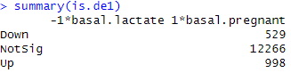

#### 2. Volcano Plot

El siguiente gráfico muestra la distribución de genes diferencialmente expresados en función de su **log Fold Change (logFC)** y su significancia estadística (-log10(*FDR*)):  

  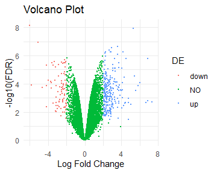

Los genes regulados a la baja se representan en **rojo**, mientras que los genes regulados al alza aparecen en **azul**.

#### 3. Ontología Génica (GO)

El análisis de **Gene Ontology (GO)** se realizó utilizando el paquete **goana**.  

A continuación, se presentan las cinco categorías más representativas:

  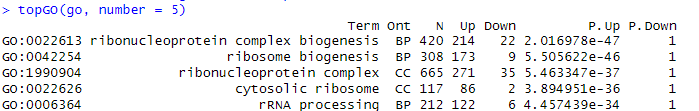

---
