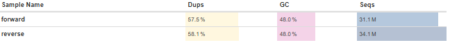
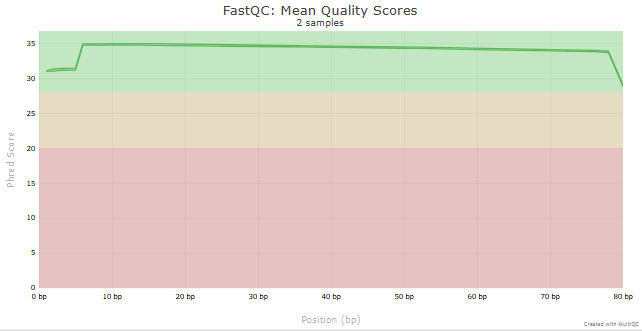
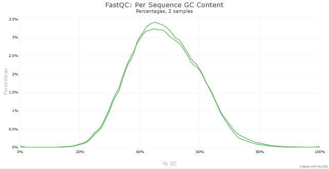
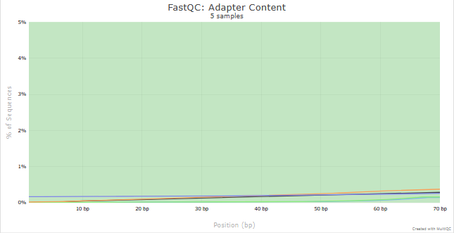
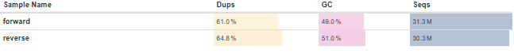
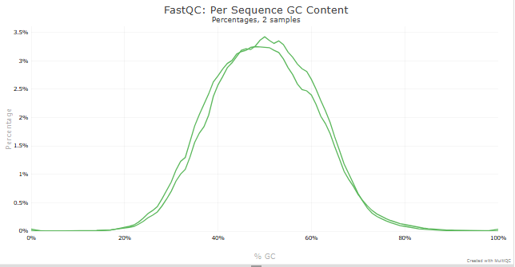
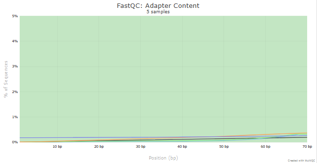

# Análisis de Control de Calidad de **H1975**
## Estadisticas básicas

  

### Calidad de Secuencia por Base

  

### Contenido de GC

  

### Contenido de adaptadores

  

# Análisis de Control de Calidad de **HCC827**
## Estadisticas básicas

  

### Calidad de Secuencia por Base

  

### Contenido de GC

  

### Contenido de adaptadores

  

