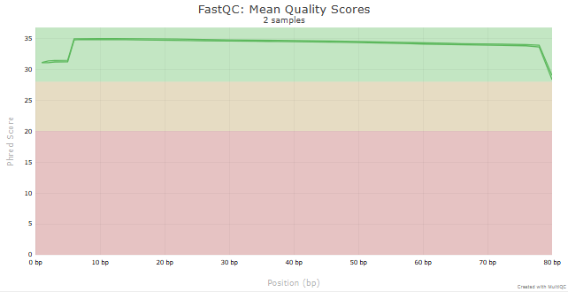

# Quality Control Analysis for **H1975**

## Basic Statistics

  

---

### Per Base Sequence Quality

  

---

### GC Content

  

---

### Adapter Content

  

---

# Quality Control Analysis for **HCC827**

## Basic Statistics

  

---

### Per Base Sequence Quality

  

---

### GC Content

  

---

### Adapter Content

  

