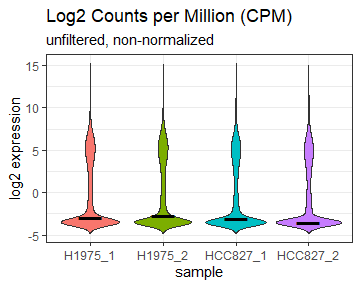
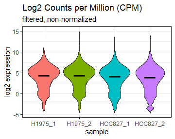
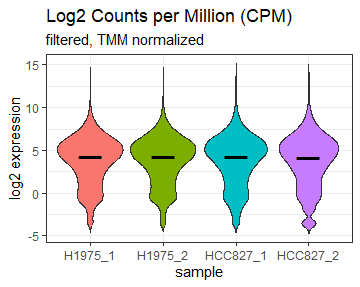
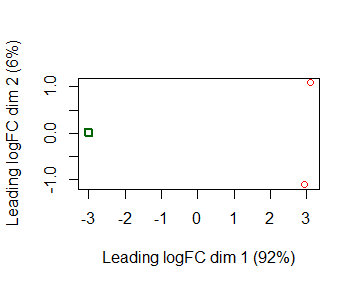
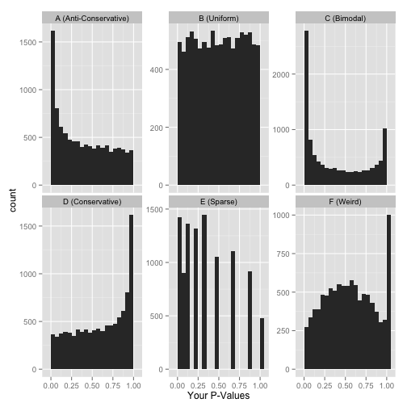
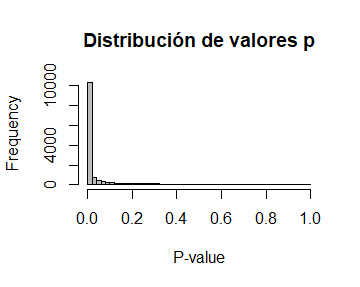
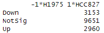

# Introducción

Este proyecto tiene como objetivo profundizar en los aspectos básicos de **RNA-seq** y las buenas prácticas para el análisis transcriptómico utilizando la plataforma Galaxy. A través de este análisis, se busca **desarrollar conocimientos avanzados sobre el análisis de expresión diferencial**, abordando temas clave como:

- La creación de gráficos para evaluar el estado de las muestras antes del análisis.
- La visualización de los efectos del filtrado de genes de baja expresión mediante gráficos específicos.
- El uso de gráficos como **MDS**, y **barplots** para explorar la distribución del p-valor y otros parámetros relevantes.

Además, se busca experimentar con el método de **pseudomapping** utilizando la herramienta **Salmon** como parte del flujo de trabajo. También se incluye un análisis básico de expresión diferencial (DGE) empleando **R**.

El proyecto utiliza como referencia los datos del estudio [*Long and short-read transcriptome profiling of human lung cancer cell lines*](https://pmc.ncbi.nlm.nih.gov/articles/PMC7545141/), proporcionando un contexto práctico para ilustrar cada aspecto abordado.

## Información de la muestra

Se basa en datos transcriptómicos generados en el marco del estudio titulado [*Long and short-read transcriptome profiling of human lung cancer cell lines*](https://pmc.ncbi.nlm.nih.gov/articles/PMC7545141/) de Dong et al. (2020). Este estudio examinó los perfiles transcriptómicos de las líneas celulares **HCC827** y **H1975**. Estas son líneas celulares presentan diferentes mutaciones en el gen **EGFR**.

Los datos utilizados incluyen lecturas _paired end_ de **RNA-Seq** generadas con tecnología **Illumina™**. Estos datos están disponibles en el repositorio SRA:

- **H1975**:
  - [SRR14286057](https://www.ncbi.nlm.nih.gov/sra/?term=SRR14286057)
  - [SRR14286058](https://www.ncbi.nlm.nih.gov/sra/?term=SRR14286058)
  
- **HCC_827**:
  - [SRR14286065](https://www.ncbi.nlm.nih.gov/sra/?term=SRR14286065)
  - [SRR14286066](https://www.ncbi.nlm.nih.gov/sra/?term=SRR14286066)

# Metodología

## Análisis de Control de Calidad

Para no alargar este README, se informa que las lecturas presentan una buena calidad. Los valores de GC están dentro de lo esperado para datos de RNA-seq, los duplicados son aceptables, el contenido de adaptadores es despreciable, y el número de secuencias es adecuado para un análisis de expresión diferencial. 

Las imágenes relacionadas con el control de calidad se pueden visualizar en el siguiente enlace: [Control de Calidad](./Control_Calidad)

## Pseudomapping

Se utilizó la configuración predeterminada de la herramienta **Salmon**, ajustando el parámetro **Kmer length** a un valor de 31. Esta decisión se basó en las recomendaciones de la [documentación oficial de Salmon](https://salmon.readthedocs.io/en/latest/salmon.html#preparing-transcriptome-indices-mapping-based-mode), donde indican _We find that a k of 31 seems to work well for reads of 75bp or longer_, en este caso las lecturas tienen 80bp de longitud, así que cumplen esta condición.

El análisis se llevó a cabo utilizando el transcriptoma de **GENCODE v47**, que se encuentra disponible en el siguiente enlace: [GENCODE v47](https://www.gencodegenes.org/human/).

Una vez generados los resultados con **Salmon**, estos se procesaron en **R** para llevar a cabo análisis adicionales, como la exploración y el análisis diferencial de expresión génica.

## Exploración de los datos

Para la exploración de los datos, se definieron los nombres de las muestras y sus grupos experimentales. Se localizaron los archivos de cuantificación de Salmon y se generó un mapa de transcritos a genes basado en GENCODE v47. Los datos se importaron con tximport para obtener una matriz de conteos, que se limpió y renombró. Finalmente, se anotaron los genes utilizando org.Hs.eg.db, eliminando duplicados y genes sin anotación válida. Los datos están preparados para el análisis DGE.

### Gráfica preliminar

Para explorar las características iniciales de los datos RNA-seq antes de aplicar análisis diferenciales o correcciones metodológicas, se hizo uso de una gráfica de tipo violin. En el eje **y** se encuentran los valores de expresión en **log2 Counts per Million (logCPM)**, mientras que el eje **x** muestra las distintas muestras: **H1975_1**, **H1975_2**, **HCC827_1** y **HCC827_2**.

Cada violín ilustra la densidad de los datos de expresión para cada muestra, proporcionando una idea de cómo se distribuyen los genes. La línea negra en el centro de cada violín señala la **mediana** de la expresión, que sirve como referencia para los niveles centrales de cada muestra.

<p align="center">
  
</p>

Se observa una acumulación significativa de genes con baja expresión por debajo de la mediana. Estos genes suelen introducir ruido en el análisis y no aportan información biológicamente relevante. El paquete **edgeR** tiene una opción denominada `filterbyExpr` para eliminar genes de baja expresión y asegurar que solo se incluyan aquellos que están biológicamente activos y relevantes para el análisis de expresión diferencial.

### Gráfica tras aplicar `filterByExpr`

Tras aplicar el filtro `filterByExpr`, se observan cambios significativos en la distribución de los datos RNA-seq, reflejados en la gráfica:

<p align="center">
  
</p>

Los genes con baja expresión, que generan ruido en los datos y afectan la interpretación, han sido eliminados. Esto se traduce en unas distribuciones más homogéneas y limpias. Tras el filtrado de genes, la mediana está ajustada a valores de expresión logCPM donde los genes ya no son ruidosos, proporcionando una referencia adecuada para comparaciones entre muestras.
Aunque los datos han sido filtrados, es necesario proceder con la normalización por TMM para corregir diferencias técnicas entre muestras, asegurando que las variaciones observadas sean de origen biológico.

### Gráfica tras aplicar TMM

Después de aplicar la normalización por TMM (Trimmed Mean of M-values), los datos RNA-seq muestran una distribución ajustada y comparable entre las muestras, reflejada en la gráfica:

<p align="center">
  
</p>

Las distribuciones de logCPM son ahora más consistentes entre las muestras, lo que indica que se han corregido las diferencias técnicas, como la profundidad de secuenciación o la composición de las librerías.
Las líneas negras que representan las medianas de las distribuciones están ahora alineadas entre las muestras, mostrando que la normalización ha equilibrado los niveles de expresión para permitir comparaciones confiables.

Gracias a TMM, las variaciones no biológicas entre las muestras han sido mitigadas, garantizando que cualquier diferencia observada sea mayoritariamente de origen biológico.

*(_Agradezco a Daniel Beiting por la profunda explicación dada sobre el análisis transcriptómico en su página [DIYtrasncriptomics](https://diytranscriptomics.com/), se ha usado parte de sus scripts para visualizar todos los pasos anteriormente mencionados_)*


### ¿Qué es un plot MDS?

El plot MDS (*Multidimensional Scaling Plot*) es una herramienta de visualización utilizada para representar gráficamente las relaciones entre muestras en un espacio de menor dimensión, generalmente en dos dimensiones. Suele ser un paso antes de proceder con análisis diferenciales, ya que ayuda a confirmar que las agrupaciones observadas coinciden con las expectativas del diseño experimental. Nos permite detectar si los agrupamientos entre muestras reflejan similitudes biológicas o hay outliers, ya sea por errores técnicos o por diferencias significativas en la biología subyacente.

### Análisis del plot MDS para las 4 muestras

El plot MDS generado para las muestras **H1975_1**, **H1975_2**, **HCC827_1** y **HCC827_2** muestra una clara separación entre dos grupos:

<p align="center">
  
</p>

- Las muestras **H1975_1** y **H1975_2** están cercanas en el espacio MDS, lo que indica que tienen perfiles de expresión génica muy similares.  
- Las muestras **HCC827_1** y **HCC827_2** forman un grupo separado, reflejando la consistencia entre las réplicas biológicas de la línea celular HCC827.

El plot MDS confirma que las diferencias observadas entre las muestras son consistentes con las expectativas experimentales: las réplicas biológicas de cada línea celular son similares entre sí, pero las líneas celulares H1975 y HCC827 tienen perfiles de expresión claramente distintos. Esto valida el diseño experimental y sugiere que los datos son confiables para proceder con análisis de expresión diferencial.

### Comprobación de la Distribución de p-valores
Otro paso recomendable a realizar es la comprobación de la distribución de los p-valores. Esto es relevante, ya que en nuestro caso porque estamos realizando una prueba estadistica con cientos, miles o incluso millones de pvalores. Al revisar el histograma, podemos identificar inmediatamente si la prueba estadística ha capturado diferencias significativas a través de muchos p-valores muy pequeños o, por el contrario, si la distribución es completamente uniforme, lo que podría indicar falta de señal o problemas en el análisis. Este gráfico permite obtener una visión inmediata del comportamiento de las pruebas a lo largo de todas las hipótesis y facilita la identificación de posibles problemas.

A continuación, se muestran seis versiones aproximadas de lo que puede parecer el histograma:

<p align="center">
  
</p>

*Imagen tomada de [How to interpret a p-value histogram](http://varianceexplained.org/statistics/interpreting-pvalue-histogram/) por David Robinson.*

En nuestros datos, el histograma de p-valores muestra una distribución muy similar a la versión **A** de los ejemplos, en la que se observa una alta frecuencia de p-valores pequeños que decae rápidamente hacia valores mayores.

<p align="center">
  
</p>

Esto sugiere que:
- Muchas de las pruebas resultan en p-valores bajos, lo que indica evidencia significativa contra la hipótesis nula en numerosos casos.
- La forma del histograma es la esperada bajo un escenario de descubrimientos reales, lo que confiere confianza en la robustez de los análisis realizados antes de la corrección por pruebas múltiples.

*(_Agradezco a Ming ‘Tommy’ Tang por la maravillosa explicación dada respecto el [p-valor](https://divingintogeneticsandgenomics.com/post/understanding-p-value-multiple-comparisons-fdr-and-q-value/), y [la importancia de realizar el paso del histograma](https://divingintogeneticsandgenomics.com/post/downstream-of-bulk-rnaseq-read-in-salmon-output-using-tximport-and-then-deseq2/)_)*

### Test estadístico
Tras haber completado todos los puntos de control y verificado que se han implementado los procedimientos necesarios para minimizar la variabilidad técnica y conservar únicamente los genes relevantes, se procede a realizar el test estadístico. Para ello, se emplea el método de Benjamini-Hochberg para controlar la tasa de descubrimientos falsos, estableciéndose un p-valor de 0,05 y utilizando un logFoldchange de 1, que corresponde al valor predeterminado.
```r
is.de1 <- decideTests(result, adjust.method = "BH", p.value = 0.05, lfc=1)
summary(is.de1)
```

<p align="center">
  
</p>

El script completo se puede visualizar [aquí](./Recursos/DEG_Salmon.R)


  
