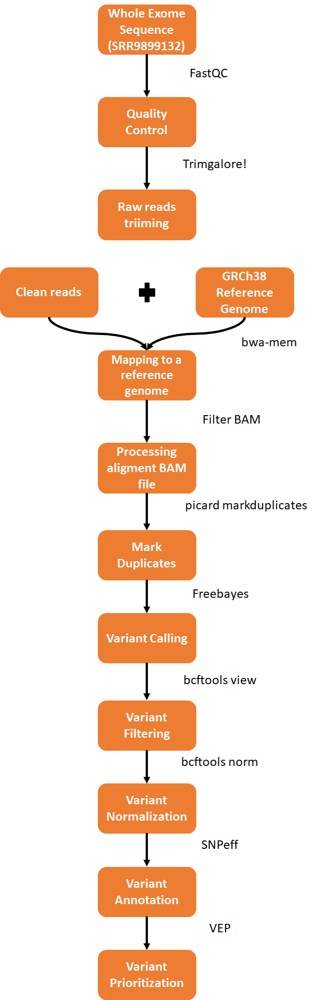
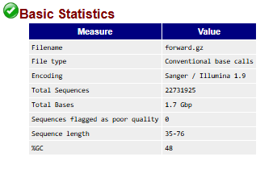
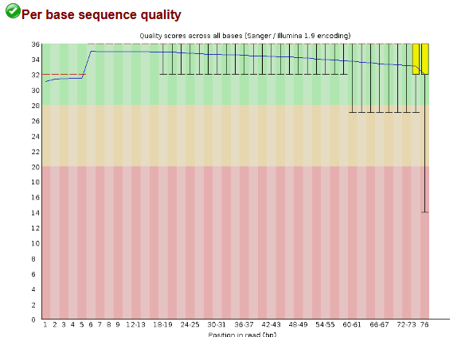
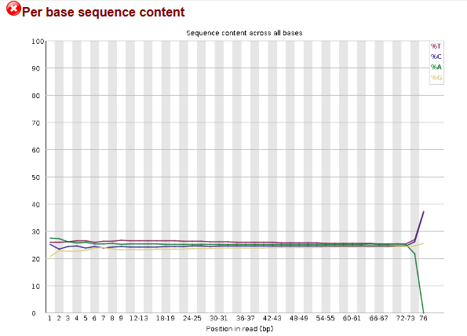
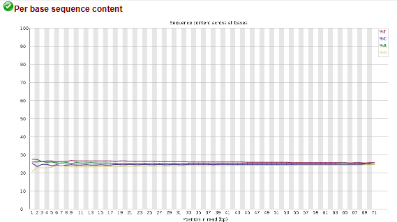

# Whole Exome Sequencing Breast Cancer Variant Calling
## Introducción
Este projecto sigue los pasos básicos mostrados en las buenas prácticas a la hora de identificar variantes en una muestra de Whole Exome Sequencing usando la plataforma Galaxy. El analisis consiste en los siguientes pasos:

  

## Información de la muestra 
La muestra analizada proviene de tejido mamario de una mujer de 53 años de origen chino. Para la captura del exoma, usaron el TruSeq Exome Library Preparation Kit y como método de secuenciación usaron la plataforma de alto rendimiento Illumina NextSeq 500 generándose las lecturas son paired end. Este conjunto de datos está disponible en el repositorio SRA bajo el número de acceso [SRR9899132](https://www.ncbi.nlm.nih.gov/sra/?term=SRR9899132).

## Metodología
### Análisis de Control de Calidad
#### Estadisticas básicas
Para evaluar la calidad de las lecturas generadas, se utilizó **FastQC**, una herramienta ampliamente empleada en este tipo de análisis. Según las estadísticas básicas proporcionadas por FastQC, el contenido de GC es del **49%**, lo cual se desvía del promedio esperado de **41%** en el genoma humano completo. Esta desviación es esperada y correcta, ya que al tratarse de un experimento de **captura de exoma (WES)**, únicamente se enriquecen los exones, que suelen tener un mayor contenido de GC en comparación con el resto del genoma.

  

---

#### Calidad de Secuencia por Base
Para evaluar la calidad de las lecturas generadas, el gráfico de calidad de secuencia por base fue generado utilizando la codificación Sanger / Illumina 1.9. Este gráfico es una herramienta clave para identificar posibles problemas en la calidad de las lecturas. 

  

---

#### Contenido de Secuencia por Base
En la sección **Per base sequence content**, se detecta una **desregulación en el porcentaje de nucleótidos** en las posiciones finales. Este comportamiento es más notable para el nucleótido **adenina (A)**, que presenta un porcentaje del **0%** en la última posición analizada.

  

## Filtrado de lecturas
Para mejorar la calidad de las lecturas, se utilizó Trim Galore con la opción --three_prime_clip_R1/2, eliminando las últimas 5 bases (5 bp) que presentaban problemas de calidad en los extremos 3'. Según las indicaciones de S. P. Pfeifer en [_From next-generation resequencing reads to a high-quality variant data set_](https://pmc.ncbi.nlm.nih.gov/articles/PMC5234474), estas lecturas se clasifican dentro del "Potential issue 1: low-quality data" y siguen la dinámica descrita en la [Figura 2b](https://pmc.ncbi.nlm.nih.gov/articles/PMC5234474/#fig2), por lo que es recomendable la eliminación de estas lecturas.

  

## Mapeo de Lecturas

El proceso de mapeo se llevó a cabo utilizando **BWA-MEM**, una herramienta ampliamente utilizada para la alineación de lecturas en análisis genómicos. Según el ensayo [_Assembling and Validating Bioinformatic Pipelines for Next-Generation Sequencing Clinical Assays_](https://www.tandfonline.com/doi/full/10.2144/000114492), el Burrows-Wheeler Aligner (BWA) ofrece una alineación más precisa en comparación con Bowtie2, lo que resulta en llamadas de variantes más fiables. Esto lo convierte en una opción preferida para aplicaciones clínicas.

La elección de BWA-MEM se basó en su capacidad para manejar lecturas largas y complejas con alta precisión, siendo ideal para experimentos como la captura de exoma, donde la exactitud del mapeo es fundamental para minimizar errores en el llamado de variantes y garantizar datos de alta calidad.

Además, se usó el genoma de referencia la versión **GRCh38** que como indica el ensayo [_Assembling and Validating Bioinformatic Pipelines for Next-Generation Sequencing Clinical Assays_](https://www.tandfonline.com/doi/full/10.2144/000114492) incluye mejoras significativas en comparación con las versiones anteriores. Estas mejoras permiten reducir errores en la detección de variantes, aumentando la precisión y fiabilidad de los resultados. Las lecturas fueron ordenadas por coordenadas de manera predeterminada en Galaxy. A continuación, se presentan las estadísticas generales del alineamiento generadas por [**Samtools flagstat**](Recursos/Samtools%20flagstat.txt).

El total de lecturas analizadas fue de **45,303,149**, de las cuales el **99.63%** se mapearon exitosamente al genoma de referencia. Además, el **99.01%** de las lecturas se mapearon de forma adecuada como pares correctamente emparejados. El porcentaje de lecturas no emparejadas (_singletons_) fue bajo, representando solo el **0.22%**.  

## Procesamiento del Archivo BAM

Para garantizar una alineación de alta calidad y preparar los datos para un análisis confiable de variantes, se realizó un procesamiento exhaustivo del archivo BAM. Según los autores de [_"Assembling and Validating Bioinformatic Pipelines for Next-Generation Sequencing Clinical Assays"_](https://meridian.allenpress.com/aplm/article/144/9/1118/427496/Assembling-and-Validating-Bioinformatic-Pipelines), las lecturas perfectamente alineadas tienen un puntaje de calidad de mapeo promedio (MAPQ) de **60** (1/10⁻⁶, es decir, una probabilidad del 0.0001% de que la alineación sea incorrecta). Por otro lado, un puntaje inferior a **30** (1/10⁻³, una probabilidad del 0.1% de error) generalmente se considera inaceptable.

Utilizando la herramienta **Filter BAM**, se aplicó un filtro para seleccionar lecturas con un **MAPQ ≥30**, eliminando aquellas de menor calidad. Además, se descartaron todas las lecturas que no estuvieran _mapped_ ni _mate mapped_ con el objetivo de obtener un conjunto de datos más limpio y de mayor calidad.

Para evaluar el impacto de este filtrado, se utilizó **Qualimap**, revelando los siguientes resultados:  
- Antes del filtrado, la media del puntaje de calidad de mapeo era de **27.27**.

  

- Tras el filtrado, esta media aumentó significativamente a **40.28**, indicando una mejora sustancial en la calidad de las lecturas.

  

Este procesamiento es fundamental para asegurar un análisis fiable en los pasos posteriores, particularmente en la identificación de variantes (_variant calling_).

## Pasos Adicionales de Procesamiento

Según el artículo [_From next-generation resequencing reads to a high-quality variant data set_](https://pmc.ncbi.nlm.nih.gov/articles/PMC5234474/#sec13), los pasos recomendados tras obtener el mapeo incluyen:
- El alineamiento local
- El marcaje de duplicados
- La recalibración de la calidad de las bases. 

Sin embargo, en este análisis, el paso de alineamiento local no se realizó porque **FreeBayes** ya incorpora este ajuste de forma interna durante el proceso de llamado de variantes. Esta funcionalidad está descrita en su [documentación oficial](https://github.com/freebayes/freebayes?tab=readme-ov-file#indels).

En cuanto a la **recalibración de calidad de bases**, estudios como [_Toward better understanding of artifacts in variant calling from high coverage samples_](https://pmc.ncbi.nlm.nih.gov/articles/PMC4271055/) han demostrado que las mejoras en la precisión del llamado de variantes tras este paso son marginales. Además, dado su alto costo computacional, puede considerarse como un paso opcional en el preprocesamiento. Por estas razones, este paso no se llevó a cabo en el análisis actual.

## Marcado de Duplicados

El siguiente paso en el procesamiento del archivo BAM fue el marcado de duplicados, realizado con la herramienta **Picard MarkDuplicates**. Antes del marcaje de duplicados, el ratio de duplicados era del **30.95%**, como se observa en el gráfico generado previamente:

  

Tras ejecutar esta herramienta, todos los duplicados fueron eliminados, dejando un archivo BAM limpio y sin lecturas duplicadas. Este proceso es crucial para reducir el sesgo y mejorar la precisión en el análisis posterior, como la identificación de variantes.

## Llamado de Variantes (Variant Calling)

El llamado de variantes se realizó utilizando la herramienta **FreeBayes**, un método eficiente para identificar variantes genéticas en datos diploides. Este enfoque asegura la captura precisa de variantes de alta calidad y prepara los datos para su posterior filtrado y anotación.

## Normalización de Variantes

Tras el llamado de variantes, se realizó un paso de **normalización** utilizando **bcftools norm**. Este proceso es fundamental para garantizar la consistencia de las variantes detectadas, estandarizando su representación al reorganizar inserciones y deleciones (INDELs), además de resolver posibles conflictos en el archivo VCF.

## Filtrado de Variantes (Variant Filtering)

Para mejorar la calidad de los datos resultantes del llamado de variantes, se aplicaron criterios de filtrado basados en las recomendaciones del artículo [_Effective filtering strategies to improve data quality from population-based whole exome sequencing studies_](https://bmcbioinformatics.biomedcentral.com/articles/10.1186/1471-2105-15-125). Según los autores, un filtrado efectivo debe enfocarse en garantizar la calidad y profundidad de las variantes detectadas. 

Por lo tanto, se utilizó **bcftools view** con la opción `-i`, aplicando los siguientes criterios:
- **QUAL > 30**: Variantes con un puntaje de calidad superior a 30, reduciendo la probabilidad de falsos positivos.  
- **DP > 10**: Un soporte de profundidad de lectura mayor a 10, asegurando mayor confianza en la validez de las variantes llamadas.

## Anotación de Variantes

La anotación de las variantes identificadas se realizó utilizando **SNPeff**, una herramienta eficiente para predecir el impacto funcional de las variantes en genes y transcripciones. Este paso es esencial para asociar las variantes detectadas con su posible efecto biológico.

## Priorización de Variantes

Para priorizar las variantes anotadas, se usó **VEP** (Variant Effect Predictor), seleccionando únicamente aquellas variantes que cumplieran con los criterios indicados en [_A Practical Guide To Filtering and Prioritizing Genetic Variants_](https://www.tandfonline.com/doi/full/10.2144/000114492):

- Variantes **exónicas** con desplazamiento de lectura, y sin sentido como:
  - `frameshift_variant`
  - `stop_gained`
  - `stop_loss`
- Variantes **missense** que se consideraron con un impacto biológico significativo. Estas fueron clasificadas como **deleterias** según predicciones realizadas por herramientas como **SIFT**, **PolyPhen**, **LRT**, **MetaSVM**, y **Mutation Taster**.

Esta priorización permitió enfocar el análisis en las variantes con mayor probabilidad de estar asociadas a efectos funcionales o patológicos:

- **Missense variants**: 34  
- **Frameshift variants**: 157  
- **Stop gained**: 70  
- **Stop loss**: 24

## Discusión de Variantes

El análisis de variantes realizado con FreeBayes produjo un total de **52,217 variantes** clasificadas en diferentes tipos.

### Clases Funcionales de Variantes

En términos funcionales, se detectaron:  
- **Variantes missense**: 17,225 (43.729%), que alteran la secuencia de aminoácidos y pueden tener un efecto significativo.  
- **Variantes nonsense**: 90 (0.228%), causando la terminación prematura de la traducción.  
- **Variantes silenciosas**: 22,075 (56.042%), que no alteran la secuencia de aminoácidos.

El ratio **missense/silent** de **0.7803** sugiere una proporción equilibrada entre variantes potencialmente dañinas y aquellas que no afectan la funcionalidad de las proteínas.

### Ts/Tv Ratio

El **Ts/Tv ratio** (ratio de transiciones a transversiones) calculado fue de **2.5334**. Este valor está en el rango esperado para datos de exoma, indicando un mapeo y llamado de variantes de alta calidad. Este ratio es útil como métrica de validación, ya que un valor dentro del rango esperado refleja precisión en las llamadas de SNPs y la calidad general del análisis.

